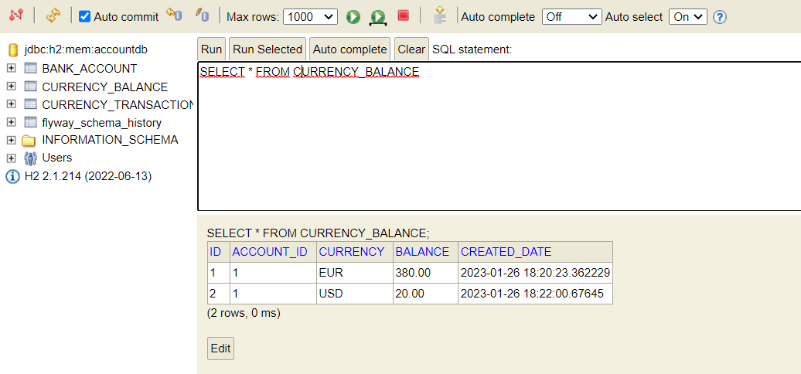
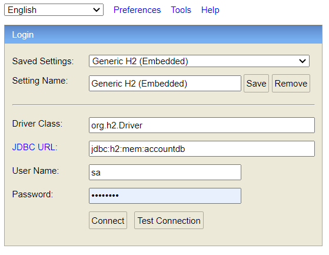

# Bank Account Rest API Sample Application

A sample Java & Spring Boot application to realize bank account deposit and withdraw processes.

## Requirements
* Java 17
* Spring Boot 2.7.8
* Spring Security
* Spring Data
* Gradle
* H2 Database
* Flyway Database Migration Tool
* Wiremock
* Postman
* REST/JSON
* An IDE or text editor (Intellij or Eclipse)

## Execution Steps
* Clone GitHub repository
* Build project
* Download dependencies
* Run Application.java class
* Application will be started on localhost 8080 port http://localhost:8080.
* To reach postman collection visit [here](bank-account-api.postman_collection.json)
* Except API end points and H2 console url, API returns 403 error for invalid request end points.
* End points are covered with Basic Authentication(user:password).
* When application is started, three database table will be created with Flywaydb integration to provide test bank account.
  * 
* Database URL can accessible. You can check database -> http://localhost:8080/h2-console
    * To access database provide details from [application.properties](src%2Fmain%2Fresources%2Fapplication.properties):
        * 

## API Definitions
* http://localhost:8080/account/deposit
    1. This api adds money to bank account for specific accountNumber.
       For more details please check api collection.
* http://localhost:8080/account/withdraw
    1. Provides withdraw operation on bank account
* http://localhost:8080/account/balance?accountNumber=testaccount
    1. This api returns balance of account with specific currencies.
* http://localhost:8080/account/exchange
    1. Exchange money service to provide exchange from one currency to other. Requires accountNumber, amount, from, to values
